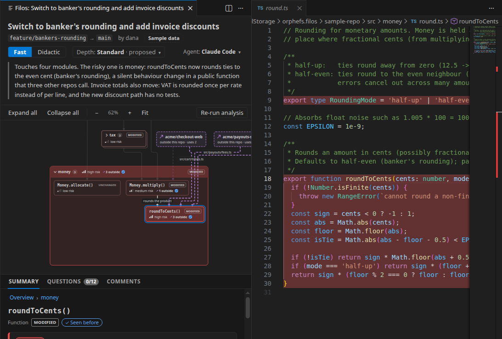
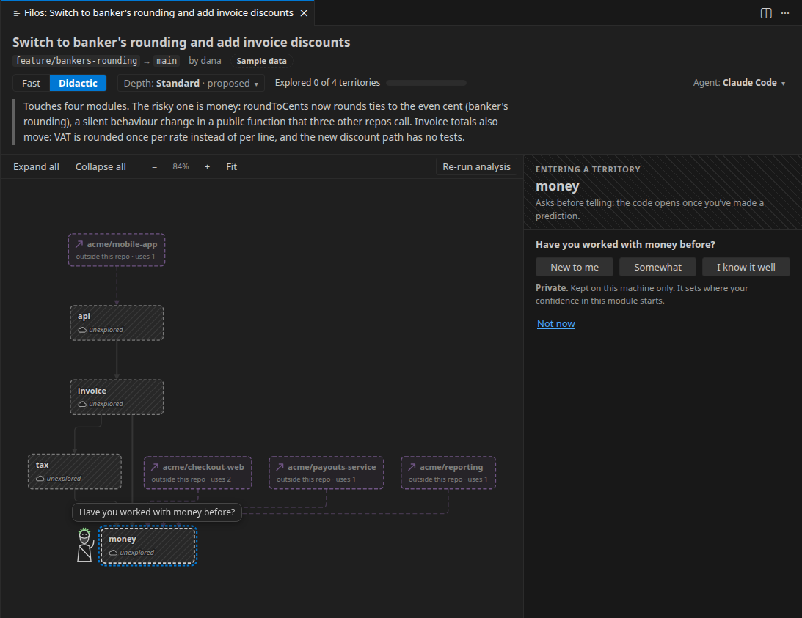
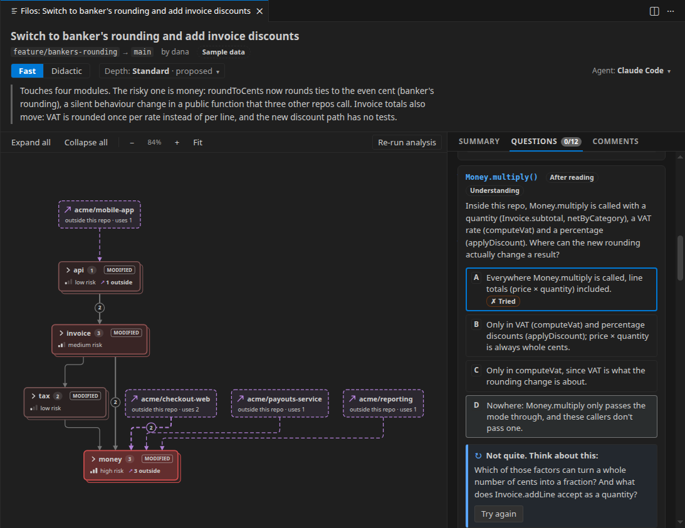
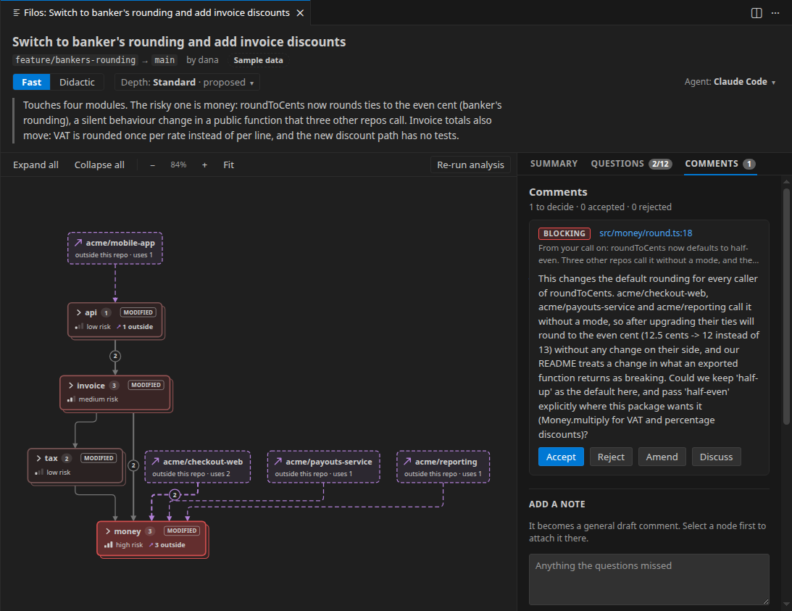

# Filos

*Filos* (Greek φίλος, friend) is Socratic pull-request review for VS Code. It shows you what a change does and asks you about it, so that you understand the code you approve rather than skimming the diff.

> **Preview.** Filos is an early prototype. Its screens and wording will change, and agent answers vary from run to run. Feedback is welcome in the [issues](https://github.com/orphefs/philos/issues).

## How it works

1. **Point Filos at a pull request.** Run **Filos: Review Pull Request…**, then pick one of the workspace repository's open pull requests or paste a URL. Filos clones the code into its own storage, never into your workspace.
2. **Read the map.** Your agent CLI (Claude Code or Codex) reads the change. Filos draws it as a graph of modules and functions, tinted redder where the risk is higher. The risk colour is computed from countable signals: consumers outside the repo, in-repo callers, public API, missing tests, behaviour changes.
3. **Open only what matters.** Click a node to open its code beside the graph. Everything unrelated stays folded, with a one-line gist of what it does.
4. **Answer questions.** Filos asks about the change before and after you read the code. A wrong answer gets a hint, not the answer.
5. **Turn your answers into comments.** Your judgements draft review comments. Accept, reject or amend each one, or discuss it with the agent.
6. **Confirm and post.** Filos shows where the review goes and how many comments it holds, and posts through the GitHub CLI only when you confirm.

## Fast or didactic

**Fast** gives you the graph, the questions and the comments, so you can get through a pull request quickly.

**Didactic** turns the change into a map in fog. To enter a module, you first say whether you know it, then predict what the change does. Only then does the code open. Progress is how much of the map you've explored, not points.

## Requirements

- VS Code 1.100 or later.
- An agent CLI, installed and logged in: [Claude Code](https://docs.anthropic.com/en/docs/claude-code) (`claude`) or the [Codex CLI](https://github.com/openai/codex) (`codex`).
- For pull requests and posting: the [GitHub CLI](https://cli.github.com) (`gh`), logged in, and `git`.

## Getting started

1. Run **Filos: Review Sample PR (bundled example)**. It opens a hand-written sample review: no agent, no cost.
2. Run **Filos: Choose Agent CLI…** to pick Claude Code or Codex. It shows whether each is installed and logged in.
3. Run **Filos: Review Pull Request…** on a real pull request.

## Commands

| Command | What it does |
| --- | --- |
| **Filos: Review Pull Request…** | Reviews a GitHub pull request, given as a URL, `owner/repo#123` or a number. |
| **Filos: Review Current Branch** | Reviews your workspace's branch against its base. |
| **Filos: Review Current Branch Against…** | The same, against a base branch you choose. |
| **Filos: Review Sample PR (bundled example)** | The bundled sample review. No agent and no cost. |
| **Filos: Review Sample PR with Agent** | Runs your agent on the same sample. |
| **Filos: Choose Agent CLI…** | Chooses Claude Code or Codex for every agent step. |
| **Filos: Delete Pull Request Checkouts** | Deletes the clones Filos keeps for pull-request reviews. |

## Settings

Filos reads these from your user settings only. A repository's `.vscode/settings.json` arrives with the code under review, so it can't choose which program Filos runs or raise its limits.

| Setting | Default | What it does |
| --- | --- | --- |
| `filos.provider` | `claude` | The agent CLI: `claude` (Claude Code) or `codex` (Codex). |
| `filos.claude.path` | `claude` | The `claude` executable: a name on PATH, an absolute path, or `~/…`. |
| `filos.claude.model` | `sonnet` | Claude Code model alias. Empty uses the CLI's default. |
| `filos.claude.maxBudgetUsd` | `1` | Spending cap in US dollars per Claude Code call. |
| `filos.codex.path` | `codex` | The `codex` executable. |
| `filos.codex.model` | empty | Codex model. Empty uses Codex's default. A ChatGPT account can't use every model. |
| `filos.codex.useUserConfig` | `false` | Load `~/.codex/config.toml`, for example for a company model provider. Filos's read-only lockdown still applies. |
| `filos.agentTimeoutSeconds` | `600` | Stops the agent CLI after this many seconds. For Codex, which reports no cost, this is the only bound. |
| `filos.gh.path` | `gh` | The GitHub CLI. |

## Cost and time

Filos runs your own agent CLI, so it uses your plan or API account.

- **Claude Code** (Sonnet): on a 14-file pull request, reading the change took about 5 minutes and cost about $0.90, and writing the questions took about 4 minutes and $0.60. A graded answer or a comment thread costs a few cents. `filos.claude.maxBudgetUsd` caps each call.
- **Codex** reports no dollar cost; runs count against your Codex plan's limits.
- You can explore the graph while the questions are being written. The bundled sample costs nothing.

## Privacy and security

- **Your code goes to your model provider.** Filos sends the pull request's code to Anthropic or OpenAI through the CLI you chose, under your account and its terms. Filos itself has no server and collects no telemetry.
- **Filos never handles credentials.** It runs your installed `claude`, `codex` and `gh` with the logins you already have.
- **The agent can only read the code under review:**
  - Claude Code runs with read-only tools (Read, Grep, Glob), no MCP servers, and without the repository's own Claude settings.
  - Codex runs in a sandbox that can read only the checkout. It has no network and can't write, and MCP servers, plugins, skills and the repository's `AGENTS.md` are all off.
  - Either way, every answer is checked against Filos's contracts before you see it.
- **Pull-request code is isolated.** It is cloned into Filos's storage with git hooks disabled. Its files open read-only, so other extensions don't treat it as one of your projects.
- **Nothing is posted without your confirmation,** and only the comments you accepted are posted.
- **Your confidence scores stay private.** How well you know each module is stored only on your machine.

## Known limitations

- Pull requests are supported on GitHub only (GitHub Enterprise through the pull request's URL).
- The Codex sandbox has been verified on Linux; macOS and Windows are untested.
- The graph, questions and comments come from a language model. Check them against the code, as Filos asks you to.

## Building from source

See [docs/development.md](docs/development.md).

## License

[MIT](LICENSE)
